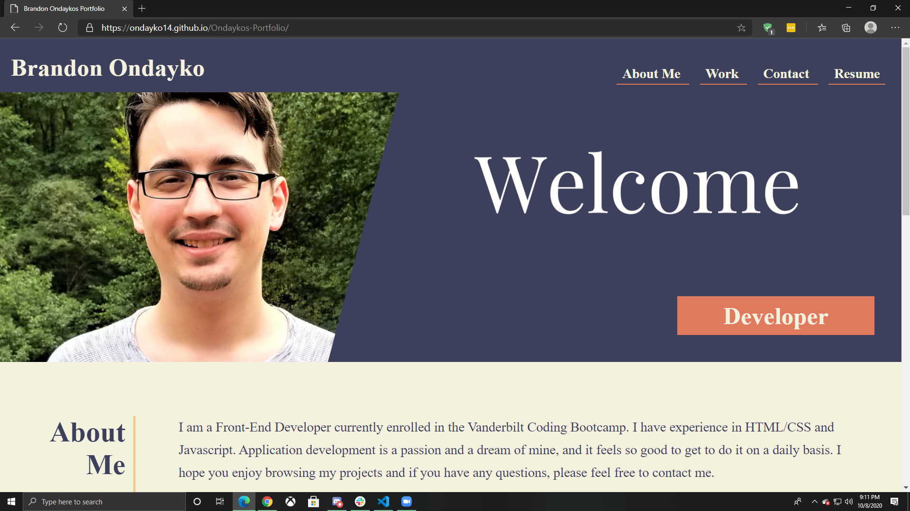

# Ondaykos-Portfolio
This is a portfolio website that I built for myself. It has funtioning Links, Media Queries, Animations, and meets accesibilty standards.

## Tecnologies Used
Html and Css

### Challenges Faced
The overall layout was restructured part way into the project in order to apply flexbox to the left hand side labels. This caused a large disruption in the workflow, however it made resizing for the smaller and larger screens much more viable.

#### URL To Website
https://ondayko14.github.io/Ondaykos-Portfolio/